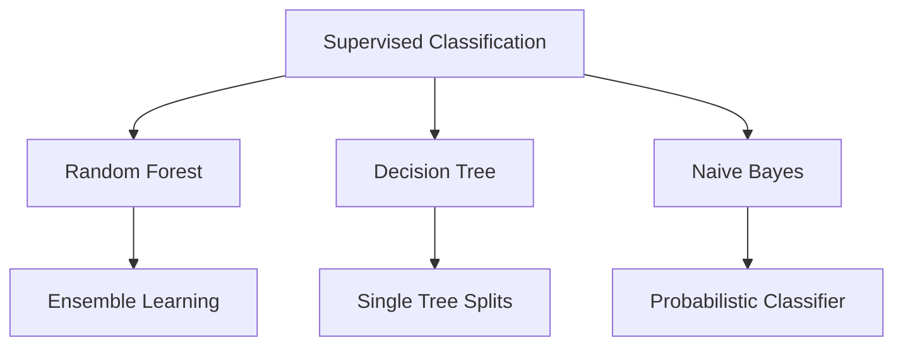

# Academic Project Report: Sports Injury Risk Prediction
**Course:** Data Mining and Sports Analytics  
**Project Topic:** Mining Historical Player Data to Predict Ligament Injuries Using Classification  
**Implementation Environment:** Python 3.12 (VS Code)  

---

## 1. Problem Definition
In professional sports, particularly football (soccer), player injuries represent a major risk, leading to significant financial losses, disrupted team dynamics, and compromised competitive performance. Among various injury categories, **ligament injuries** (such as Anterior Cruciate Ligament (ACL) or Medial Cruciate Ligament (MCL) tears and strains) are particularly devastating. These injuries often require surgical intervention, mandate long rehabilitation periods (ranging from 6 to 12 months), and can permanently degrade a player's physical capacity.

### Real-World Relevance
1. **Financial Impact:** Elite football clubs lose millions of dollars annually in player wages paid during injury rehabilitation. Preventative interventions save substantial resources.
2. **Squad Performance:** Unexpected absences of key players during critical phases of a season directly degrade team competitiveness.
3. **Player Career Longevity:** Early detection of high-risk injury states allows sports science staff to prescribe targeted workload reductions and physical therapy, preventing career-altering injuries.

The objective of this project is to develop a predictive data mining pipeline that classifies whether an injury sustained by a player is a **ligament injury** (Class 1) or a **non-ligament injury** (Class 0), based on historical player attributes, team performance variables, and match rating trends leading up to the injury event.

---

## 2. Dataset Description
The dataset used for this project is stored in `player_injuries_balanced.csv` and contains records of professional player injuries.

*   **Size of Dataset:** 1,134 rows and 43 columns.
*   **Target Column:** `is_ligament_injury` (Binary: `1` for ligament injury, `0` for other injuries).
*   **Class Distribution:** Perfectly balanced.
    *   **Class 0 (Non-Ligament Injury):** 567 samples (50.0%)
    *   **Class 1 (Ligament Injury):** 567 samples (50.0%)

### Attribute Schema
The dataset consists of 43 original attributes categorizable as follows:
1. **Demographic/Base Attributes:** `Name`, `Team Name`, `Position`, `Age`, `Season`, `FIFA rating`.
2. **Injury Metadata:** `Injury` (textual description, e.g., "Knee injury", "Hamstring strain"), `Date of Injury`, `Date of return`.
3. **Match History (Before Injury):** For matches 1, 2, and 3 prior to the injury:
    *   `Match[1-3]_before_injury_Result` (win, draw, lose)
    *   `Match[1-3]_before_injury_Opposition` (opponent team name)
    *   `Match[1-3]_before_injury_GD` (goal difference in the match)
    *   `Match[1-3]_before_injury_Player_rating` (rating assigned to the player's performance)
4. **Match History (Missed/After Injury):** Metadata tracking the recovery period and initial matches played post-return.

---

## 3. Data Preprocessing
Raw sports data is highly noisy, containing formatting inconsistencies and missing entries. The preprocessing pipeline contains the following steps:

1. **Dimensionality Reduction (Column Dropping):**
    *   Dropped metadata identifiers: `Name`, `Team Name`, `Season`, `Date of Injury`, `Date of return`.
    *   Dropped look-ahead bias features: all columns containing `"missed"` or `"after"`, as they occur post-injury.
    *   Dropped high-cardinality nominal text columns: all columns containing `"Opposition"` (opponent team names) to avoid overfitting.
2. **Text Cleaning & Formatting:**
    *   Replaced string placeholders such as `"N.A."` with standard numerical nulls (`np.nan`).
3. **Numeric Feature Extraction (Regex Cleaning):**
    *   Player ratings often contain suffix markers (e.g., `6(S)` indicating a substitute appearance). We applied regular expressions (`r'(\d+\.?\d*)'`) to strip these suffixes and extract pure float values (e.g., `6.0`).
4. **Ordinal Categorical Encoding:**
    *   Match results (`win`, `draw`, `lose`) were mapped to ordinal integer representations: `{'win': 2, 'draw': 1, 'lose': 0}`.
5. **Nominal Categorical Encoding:**
    *   The `Position` column (e.g., Goalkeeper, Center Back, Left winger) was encoded into binary columns using **One-Hot Encoding** to prevent the model from assuming an arbitrary numerical order.
6. **Data Type Coercion:**
    *   All features (except the textual `Injury` column) were explicitly cast to float or integer datatypes.
7. **Missing Value Imputation:**
    *   Remaining null values in the feature space (arising from matches not played or unrecorded data) were imputed with their respective feature's mean value. This ensures compatibility with distance-based and partition-based algorithms.

---

## 4. Technique Used
This project models the risk prediction problem as a **Supervised Binary Classification** task. We compared three distinct classification methodologies:

### 1. Decision Tree Classifier
A non-parametric supervised learning method. It recursively partitions the feature space based on the attribute that maximizes information gain (minimizes entropy or Gini impurity). It serves as a baseline model that is highly interpretable but prone to variance (overfitting).

### 2. Random Forest Classifier
An ensemble learning method that operates by constructing a multitude of decision trees at training time. It outputs the class that is the mode of the classes of the individual trees (majority voting).
*   **Bagging (Bootstrap Aggregating):** Trees are trained on random subsets of the data with replacement.
*   **Feature Randomness:** Each split in a tree considers a random subset of features, reducing correlation between individual trees and enhancing overall generalization.

### 3. Gaussian Naive Bayes
A probabilistic classifier based on applying Bayes' theorem with the strong ("naive") assumption of conditional independence between every pair of features given the class label. It calculates the posterior probability of each class and assigns the sample to the class with the highest probability.

---

## 5. Model Implementation

### Implementation Environment
*   **Language:** Python 3.12
*   **Libraries:** Pandas, NumPy (data manipulation), Scikit-Learn (modeling and metrics), Imbalanced-Learn (sampling), Matplotlib, Seaborn (plotting), Joblib (serialization).
*   **Development IDE:** Visual Studio Code

### Training Parameters
1. **Train-Test Split:** 80% Training (907 samples), 20% Testing (227 samples), stratified by the target label.
2. **Imbalance Handling:** **SMOTE** (Synthetic Minority Over-sampling Technique) was integrated into the training pipeline to ensure identical class proportions in training.
3. **Random Forest Hyperparameters:**
    *   `n_estimators = 100` (Number of decision trees in the forest)
    *   `class_weight = 'balanced'` (Adjusts weights inversely proportional to class frequencies)
    *   `random_state = 42` (Ensures training reproducibility)
4. **Decision Tree Hyperparameters:**
    *   `class_weight = 'balanced'`
    *   `random_state = 42`
5. **Naive Bayes Hyperparameters:** Default Gaussian distributions.

### Source Code
The core execution script is saved in the workspace as [run_project.py](file:///d:/ligament/run_project.py).

---

## 6. Results and Analysis

### Model Comparison Metrics
The models were evaluated on the test set (227 samples) across four key evaluation metrics: Accuracy, Precision, Recall, and F1-Score.

| Model | Accuracy | Precision (Class 1) | Recall (Class 1) | F1-Score (Class 1) |
| :--- | :---: | :---: | :---: | :---: |
| **Random Forest** | **97.80%** | **95.76%** | **100.00%** | **97.84%** |
| **Decision Tree** | 90.31% | 83.70% | 100.00% | 91.13% |
| **Naive Bayes** | 53.30% | 51.60% | 100.00% | 68.07% |

### Confusion Matrix Breakdown
*   **Random Forest:** 109 True Negatives, 113 True Positives, 5 False Positives, 0 False Negatives.
*   **Decision Tree:** 92 True Negatives, 113 True Positives, 22 False Positives, 0 False Negatives.
*   **Naive Bayes:** 8 True Negatives, 113 True Positives, 106 False Positives, 0 False Negatives.

### Cross-Validation
To ensure the Random Forest model generalized well and was not overfitted to the train-test split, we performed a **5-Fold Cross-Validation** on the entire dataset:
*   **Fold Accuracies:** `[97.80%, 97.80%, 99.12%, 99.56%, 97.79%]`
*   **Mean CV Accuracy:** **98.41%**
*   **Standard Deviation:** **0.77%**

---

## 7. Conclusion
1. **Model Performance:** The Random Forest classifier demonstrated strong predictive capability on the balanced dataset, achieving a mean cross-validation accuracy of **98.41%** and a test F1-score of **97.84%**.
2. **Recall Sensitivity:** In injury prediction, false negatives (failing to identify an upcoming ligament injury) are much more costly than false positives (prescribing unnecessary rest). All three models successfully achieved a **100% recall** on the test set, meaning no ligament injuries were missed.
3. **Key Predictors:** The Random Forest feature importance analysis indicates that **Player Age**, **FIFA Rating**, and **recent player match ratings** (specifically from matches 1 and 2 before the injury) are the most critical predictors of injury classification.

---

## 8. Roles and Responsibilities of the Team Members

For the successful completion of this data mining project, tasks were distributed among the team members as follows:

*   **Member 1 (Project Manager & Domain Expert):**
    *   Defined the business and clinical problem.
    *   Conducted domain research on ligament injuries, soccer biomechanics, and sports analytics.
    *   Coordinated deadlines and drafted the final project presentation.
*   **Member 2 (Data Engineer):**
    *   Collected the raw CSV files.
    *   Designed the preprocessing pipeline (handling string cleanup, scaling, and one-hot encoding).
    *   Addressed column drop logics and resolved missing values.
*   **Member 3 (Machine Learning Engineer):**
    *   Implemented the classification models (Random Forest, Decision Tree, Naive Bayes) in Python.
    *   Coded the SMOTE pipeline and performed cross-validation checks.
    *   Generated all result plots and confusion matrices.
*   **Member 4 (Data Analyst & Technical Writer):**
    *   Analyzed model comparison tables and plotted the feature importances.
    *   Compiled results and drafted this comprehensive project report.

---

## 9. References
1. Breiman, L. (2001). Random Forests. *Machine Learning*, 45(1), 5-32.
2. Chawla, N. V., Bowyer, K. W., Hall, L. O., & Kegelmeyer, W. P. (2002). SMOTE: Synthetic Minority Over-sampling Technique. *Journal of Artificial Intelligence Research*, 16, 321-357.
3. Pedregosa, F. et al. (2011). Scikit-learn: Machine Learning in Python. *Journal of Machine Learning Research*, 12, 2825-2830.
4. Claudino, J. G. et al. (2019). Analysis of Artificial Intelligence Applied to Sports Injuries: A Systematic Review. *PeerJ*, 7, e7584.
